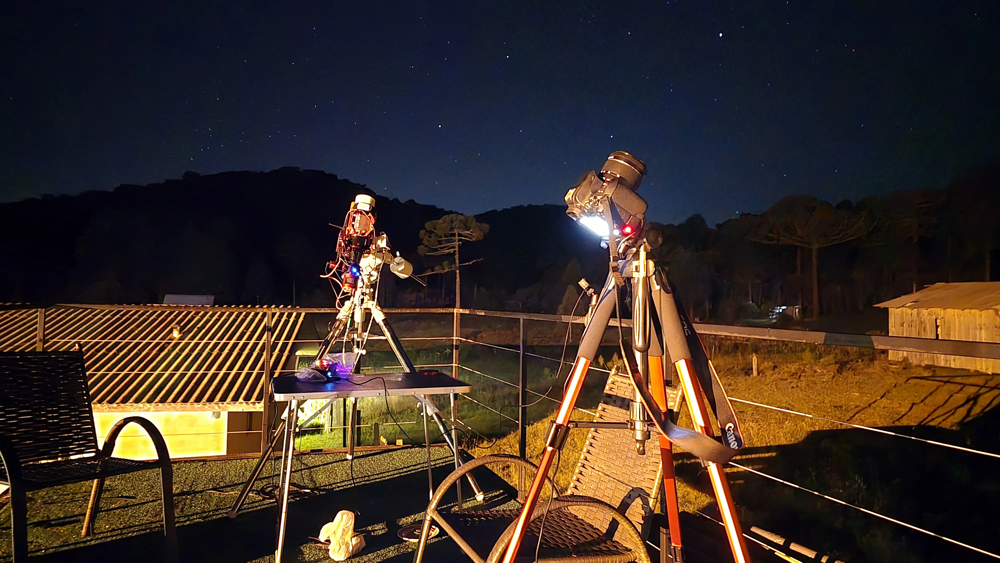
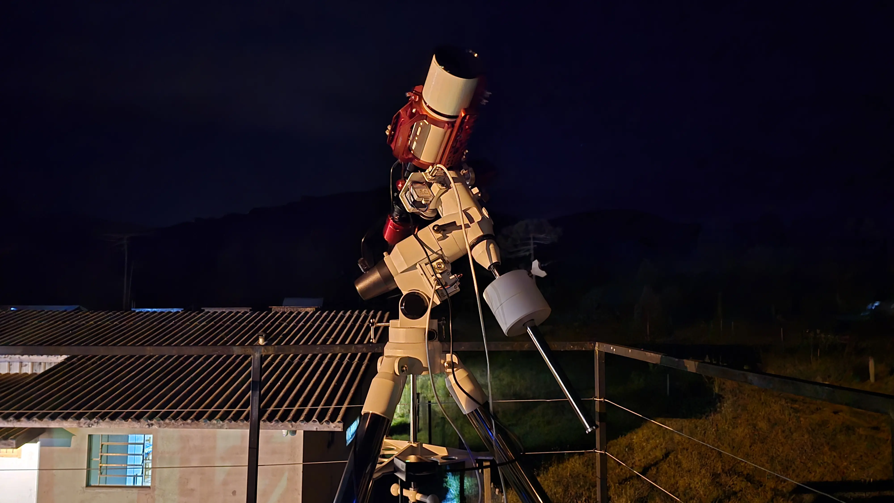
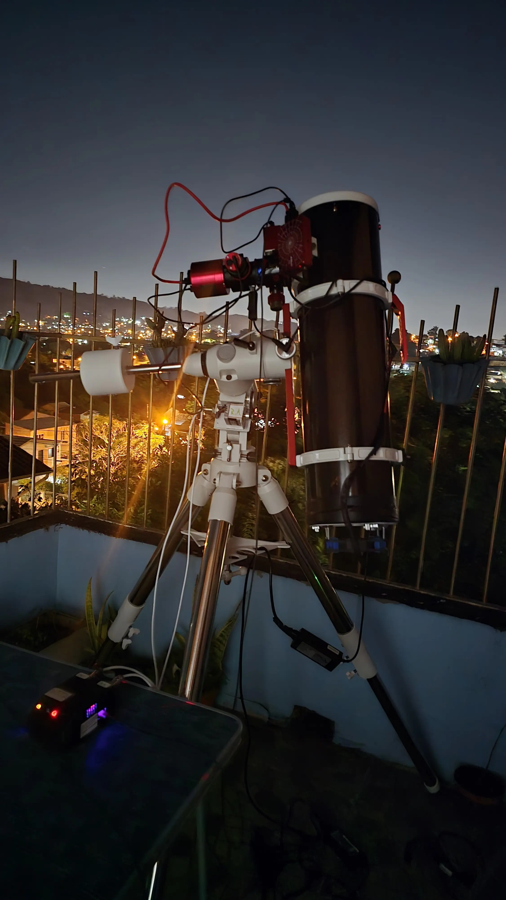
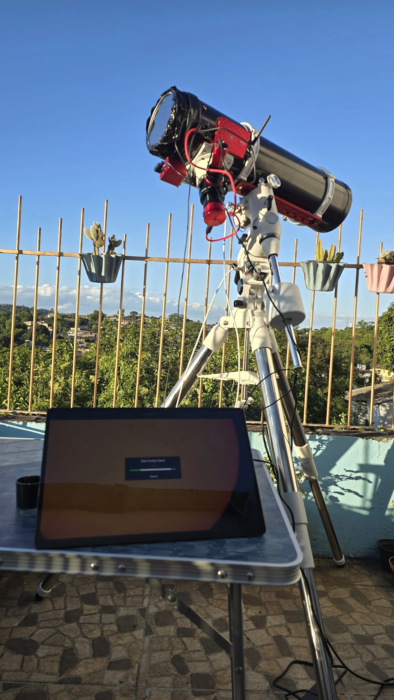

Montar um setup de astrofotografia é um processo gradual — cada peça escolhida tem um papel específico, e o conjunto precisa funcionar em harmonia. Neste post apresento os equipamentos que compõem meu sistema atual, usado tanto em sessões fixas em Porto Alegre quanto em expedições a céus mais escuros, como Cambará do Sul.

---

## Telescópios

### ASKAR FRA400 — Refrator Apocromático

O FRA400 é meu telescópio principal para Deep Sky. Trata-se de um refrator apocromático de alta qualidade óptica, compacto e de montagem rápida — características essenciais para sessões portáteis. Com o redutor focal 0.7x, amplio o campo e reduzo a relação focal, tornando-o ainda mais eficiente para objetos de emissão como nebulosas em banda estreita. É o parceiro ideal para capturar a Nebulosa da Carina, remanescentes de supernova e galáxias de tamanho médio.

**Características principais:**
- Refrator apocromático com excelente correção cromática
- Portátil e de montagem ágil
- Compatível com redutor 0.7x
- Ideal para nebulosas em banda estreita e galáxias

---

### Newtoniano 150mm / f5 (750mm)

O Newtoniano de 150mm de abertura e 750mm de distância focal é meu instrumento de maior poder de coleta de luz e resolução. É utilizado tanto para astrofotografia planetária de alta resolução — Júpiter, Saturno e Lua — quanto para Deep Sky intermediário. Por ser um sistema refletor, exige colimação periódica, processo que realizo com colimador laser e câmera dedicada para garantir a máxima nitidez.

**Características principais:**
- Abertura: 150mm / Focal: 750mm
- Alta resolução para planetária
- Maior poder de coleta de luz para objetos difusos
- Requer colimação regular

---

## Montagem — EQ-5 com OnStep

A montagem equatorial motorizada EQ-5, modernizada com o sistema **OnStep**, é o coração do setup. O OnStep é uma solução open-source de controle que transforma montagens mecânicas em plataformas capazes de tracking de alta precisão, goto e integração com autoguiding.

A motorização foi adquirida através do **[OnStep Brasil](https://www.instagram.com/onstepbrasiloficial/)**, um projeto nacional que oferece kits de motorização já configurados e serviço de instalação — uma excelente opção para quem quer modernizar a montagem sem precisar lidar com eletrônica do zero. O kit pode ser encontrado na [Fóton Astro](https://fotonastro.com.br/produto/motorizacao-onstep-e-servico-de-instalacao/), com suporte em português e envio para todo o Brasil.

A montagem é controlada pelo **ASIAIR Plus**, que centraliza todo o gerenciamento da sessão — desde o alinhamento polar até o disparo automatizado das sequências de captura.

**Capacidades:**
- Tracking preciso em AR e DEC
- Suporte a autoguiding
- Controle via ASIAIR Plus
- Compatível com longas exposições (>5 minutos por frame)

---

## Câmeras

### ZWO ASI533MC Pro — Deep Sky

A ASI533MC Pro é minha câmera principal para astrofotografia de campo profundo. Trata-se de uma CMOS colorida refrigerada, com sensor quadrado de 11,1MP que elimina cantos escuros e oferece excelente relação sinal-ruído mesmo em longas exposições. O sistema de refrigeração ativa reduz o ruído térmico significativamente, permitindo sessões de vários horas com qualidade consistente.

**Características principais:**
- Sensor CMOS Sony IMX533, 11,1MP (3008×3008px)
- Refrigeração ativa (até -35°C abaixo da temperatura ambiente)
- Compatível com filtros de banda estreita (L-eXtreme)
- Baixo ruído de leitura e alto well depth

---

### ZWO ASI662MC — Planetária

Para astrofotografia planetária, velocidade é tudo. A ASI662MC é uma câmera de alta taxa de quadros, permitindo capturar centenas de frames por segundo nos momentos de melhor seeing atmosférico. O resultado são vídeos curtos que, após processamento com software como o AutoStakkert!, revelam detalhes finos nas nuvens de Júpiter, anéis de Saturno e crateras lunares.

**Características principais:**
- Alta taxa de frames (ideal para Lucky Imaging)
- Sensor sensível e de baixo ruído
- Uso em conjunto com o Newtoniano 150mm
- Captura em vídeo para posterior stacking

---

### ZWO ASI120 — Câmera de Guia

A ASI120 é dedicada exclusivamente ao autoguiding. Acoplada a uma luneta guia, ela monitora em tempo real o comportamento da montagem e envia correções ao OnStep via ASIAIR Plus. Um guiding abaixo de **1,5 arcsec RMS** é minha meta para garantir estrelas pontiformes em exposições longas.

**Função:** Autoguiding ativo via ASIAIR Plus (RA e DEC)

---

### GoPro Hero 12 Black — Timelapse

Para timelapses astronômicos e registros ambientais de campo, uso a GoPro Hero 12 Black. Com controle manual de obturador, ISO e intervalo entre frames, ela produz sequências impressionantes do movimento aparente do céu — inclusive durante o nascer e pôr da Lua. É minha ferramenta de documentação portátil para expedições.

---

### Samsung Galaxy S24 Ultra + DJI Osmo Mobile 6 — Timelapse Mobile

Além da GoPro, utilizo o **Samsung Galaxy S24 Ultra** para timelapses noturnos com tripé. A câmera do S24 Ultra oferece excelente sensibilidade em baixa luminosidade e controle manual avançado de exposição, shutter e ISO — o suficiente para capturar o movimento das estrelas de forma impressionante direto pelo smartphone.

Para garantir estabilidade máxima e eliminar qualquer vibração durante as capturas, o telefone é acoplado ao **DJI Osmo Mobile 6**, um gimbal de 3 eixos que, mesmo em modo estático com tripé, oferece uma plataforma rígida e balanceada. A combinação entre o S24 Ultra e o Osmo Mobile 6 é um setup leve, rápido de montar e surpreendentemente capaz para documentar sessões de campo.

---

## Controlador — ASIAIR Plus

O **ASIAIR Plus** é o hub central de todo o setup. Ele conecta e controla câmeras, montagem, focalizador e filtros a partir de um único aplicativo no tablet ou smartphone. Entre as funções que mais utilizo estão o plate solving automático (para centralizar objetos com precisão), o alinhamento polar assistido e o dithering — técnica essencial para eliminar padrões de ruído em sessões de longa duração.

**Funções principais:**
- Controle de câmeras ZWO
- Controle da montagem via OnStep
- Plate solving e goto automatizado
- Alinhamento polar (SharpCap-style)
- Autoguiding integrado
- Dithering entre sub-exposições
- Sequências automatizadas

---

## Filtros

A escolha do filtro certo pode transformar completamente o resultado de uma imagem, especialmente sob céus urbanos com moderada poluição luminosa.

| Filtro | Uso principal |
|---|---|
| **Optolong L-Pro** | Deep Sky em banda larga, redução de poluição luminosa |
| **Optolong L-eXtreme** | Banda estreita (Hα + OIII), nebulosas de emissão |
| **CLS** | Redução geral de poluição luminosa |
| **UHC** | Nebulosas de emissão e planetárias |
| **IR/UV Cut** | Proteção e nitidez em câmeras sem filtro AA |
| **Moon Filter** | Redução de brilho lunar para observação e fotografia |

O **L-eXtreme** é sem dúvida o filtro que mais utilizo nas sessões Deep Sky com a ASI533MC Pro — ele isola as emissões de hidrogênio-alfa e oxigênio-III com eficiência, permitindo capturar detalhes finos em nebulosas mesmo a partir de Porto Alegre.

---

## Onde Comprar — Loja Recomendada

A maioria dos meus equipamentos foi adquirida na **[Fóton Astro](https://fotonastro.com.br)**, que considero a referência nacional em equipamentos astronômicos. A Fóton Astro é a maior loja de telescópios e equipamentos astronômicos do Brasil, com envio para todo o país, garantia de 1 ano e um catálogo completo que vai de telescópios e montagens até câmeras ZWO, filtros Optolong e acessórios de automação — exatamente o que um astrofotógrafo precisa. Para quem está começando ou expandindo o setup, é o lugar certo para pesquisar e comprar com segurança.

---

## Considerações Finais

Este é um setup em constante evolução. Cada sessão revela algo novo — seja uma limitação do guiding, uma oportunidade de otimização do foco ou um novo objeto que merece exploração. O hemisfério sul oferece alvos únicos e privilegiados, como a Nebulosa da Carina, as Nuvens de Magalhães e o centro galáctico — e é exatamente isso que me motiva a continuar refinando cada componente deste sistema.

Nos próximos posts, vou detalhar meu fluxo de trabalho completo, desde o planejamento da sessão até o processamento final das imagens.

**Céu limpo para todos!** 🌌