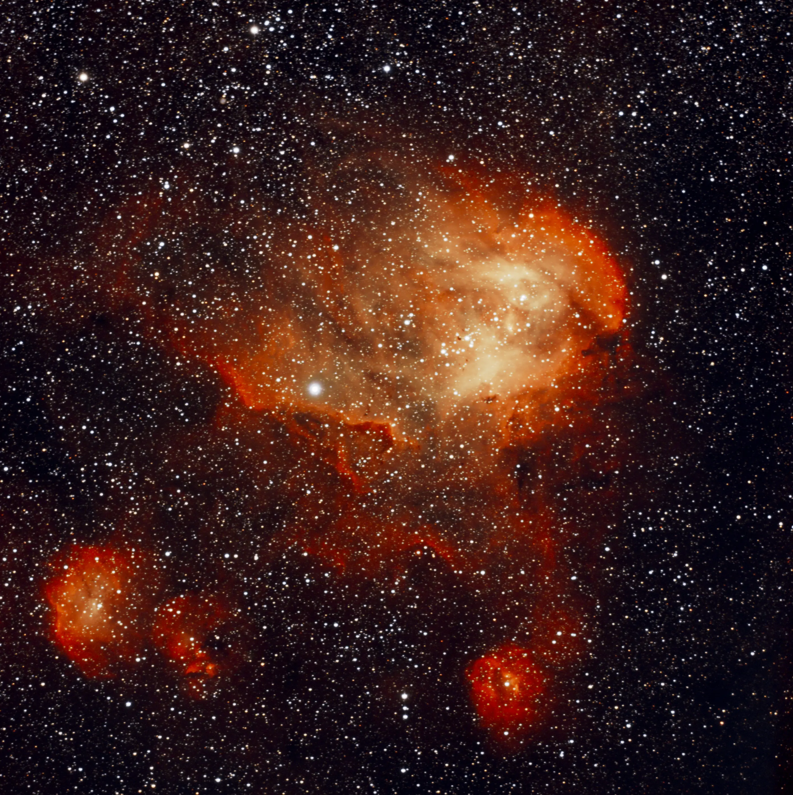

## IC 2944 — Lambda Centauri Nebula

IC 2944, also known as the **Lambda Centauri Nebula** or **Running Chicken Nebula**, is an emission nebula in the constellation Centaurus, roughly 6,000 light-years away. The region hosts a young open star cluster — Lambda Centauri — whose massive stars ionize the surrounding hydrogen, producing the reddish structures characteristic of HII regions.

One of the most fascinating objects associated with IC 2944 are the **Thackeray's Globules** — small, opaque clouds of gas and dust visible against the nebula's glow, considered candidate stellar nurseries in an early stage of gravitational collapse.

---

## Capture

This was my first image of IC 2944 with the **Optolong L-eXtreme** filter, which selectively passes the H-alpha (656nm) and OIII (500nm) bands while blocking most urban light pollution. Porto Alegre has severe light pollution — the L-eXtreme is an essential tool for pulling emission nebulae under these conditions.

The session produced **72 frames** captured via ASIAIR Plus, with active guiding through the ZWO ASI120 and dithering enabled to reduce fixed-pattern noise. Stacking was done in **Siril 1.4.0-beta2** with the **Winsorized Sigma Clipping** method (low=3.0, high=3.0), resulting in a balanced per-channel rejection of 0.12% to 0.68%.

---

## Processing

The processing workflow followed the standard OSC narrowband pipeline:

### In Siril 1.4.0-beta2

**1. Background Extraction (GraXpert 3.0.2 — Umbriel)**
Gradient removal with the AI algorithm, smoothing 0.5, GPU acceleration active via DmlExecutionProvider. The L-eXtreme tends to introduce subtle gradients even in fields without dominant light pollution — the extraction was kept gentle to preserve the nebula's diffuse emission.

**2. Color Calibration — SKIPPED**
With a narrowband filter, photometric color calibration (PCC) is not applicable — the filter artificially biases the color channels by passing only H-alpha and OIII. This step is reserved for broadband (L-Pro) images.

**3. Stretch — Generalised Hyperbolic Stretch (GHS)**
Parameters used:
- D: 3.80 / b: 5.0 / SP: 0.22 / HP: 0.98
- Colour model: Even weighted luminance

SP at 0.22 was chosen for diffuse nebulae — higher than the value used for globular clusters (~0.13), placing the stretch inflection in the midtones and pulling out faint halo structures without saturating the core.

**4. Denoising (GraXpert AI)**
Strength: 0.70 — slightly more aggressive than usual to compensate for the inherent noise in narrowband images. Runtime: ~1 min 46s with GPU.

**5. Curves Transformation**
Gentle 6-point S-curve on the master RGB channel to increase contrast and depth without introducing clipping (Clip: 0.000%).

**6. SCNR — Green Noise Removal**
Average neutral algorithm, preserving lightness. The L-eXtreme tends to leave a residual green cast — SCNR removes this artifact efficiently.

**7. Color Saturation**
One pass with Amount: 0.25 and Background factor: 0.50, concentrating saturation on stars and nebula without contaminating the background.

**8. Warm Cast Correction**
A gentle curve on the master RGB channel (X=0.15, Y=0.13) to neutralize the residual reddish background cast. I found in this session that correcting on the master RGB channel is safer than on the isolated Red channel, which tends to create reddish halos around the nebula's edges.

### In Affinity V2 (Pixel Studio)

- **Curves:** visual stretch to compensate for the exported TIFF's linearity
- **Levels:** black input at 1% — enough to darken the background without clipping faint stars
- **HSL:** global saturation +15% to bring out the richness of the star field colors

---

## What's in the image

The ASKAR FRA400's field of view with the ASI533MC Pro covers a generous region of Centaurus, revealing:

- **IC 2944** — the main nebula, with a well-defined bubble structure and internal density variations
- **IC 2948** — the adjacent nebula, visually integrated into the central region
- **Two secondary HII regions** in the lower corner of the frame — smaller emission structures that are part of the same nebular complex
- **Dense star field** characteristic of the proximity to the galactic plane

---

## Lessons from this session

**L-eXtreme vs L-Pro — different approaches:**
Working in narrowband requires specific adjustments at every processing step. PCC is invalid, the GHS SP point should be higher, and b should be more aggressive to pull out diffuse structures. Final saturation should be more conservative, since H-alpha is already naturally intense.

**Cast correction in narrowband:**
The temptation is to correct the warm background cast on the isolated Red channel — but that creates an unwanted reddish halo around the nebula's edges. Correcting on the master RGB channel, with a gentle shadow point, is safer and produces a more natural result.

**Multi-session stacking:**
This image will eventually be integrated with an additional 30 frames captured in a previous session with the same equipment. Siril supports multi-session stacking — calibrate each night separately, then combine the calibrated lights before the final stack. With more integration, the diffuse halo structures and Thackeray's Globules should appear with greater detail.

---

## Next steps

- Integrate the additional 30 frames to increase SNR and reveal fainter structures
- Revisit the target from Cambará do Sul (Bortle ~4) to compare the difference of a dark sky
- Attempt SHO palette in Affinity to explore the H-alpha / OIII separation

---

*Processed with Siril 1.4.0-beta2, GraXpert 3.0.2 (Umbriel), StarNet v2, and Affinity V2.*
