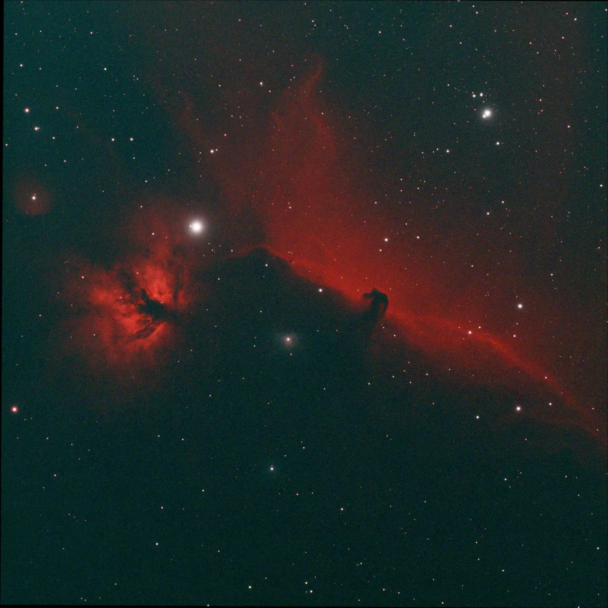
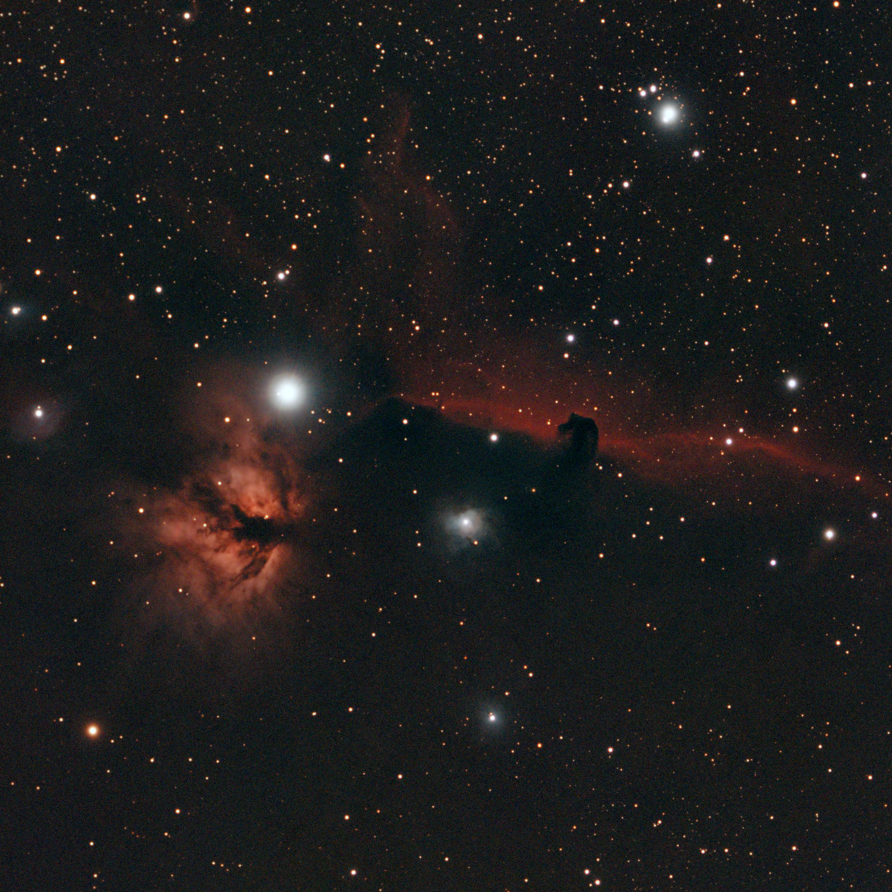
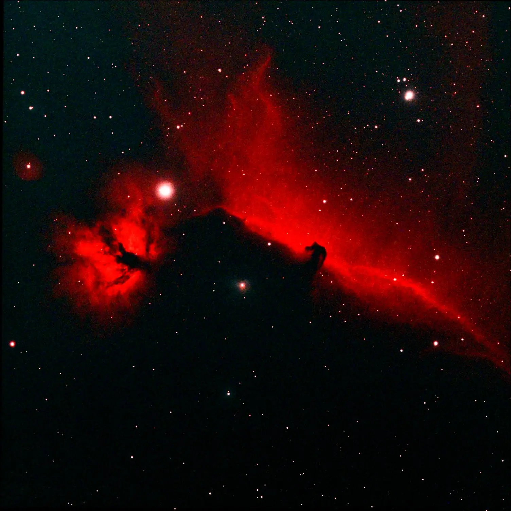
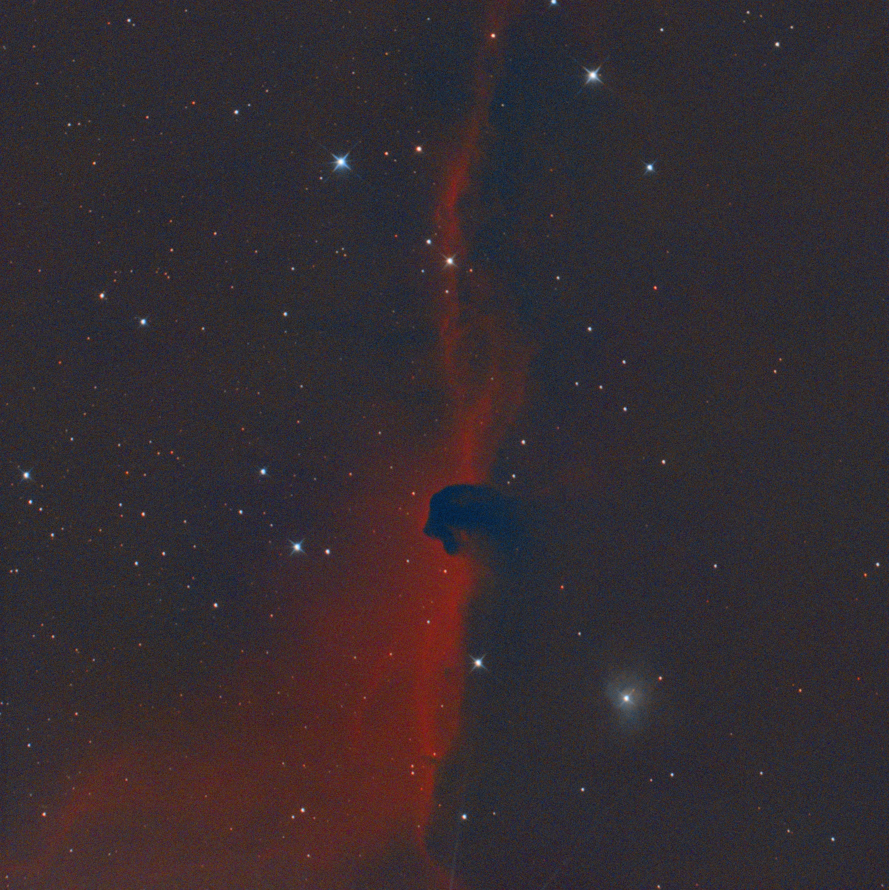

IC 434 é uma nebulosa de emissão na constelação de Orion, conhecida pela silhueta escura em forma de cabeça de cavalo — a Barnard 33 — recortada contra o brilho avermelhado do hidrogênio ionizado. Fica a cerca de 1.500 anos-luz de distância e é uma das regiões mais fotografadas do céu de inverno do hemisfério sul.

O desafio aqui é o céu. Porto Alegre tem poluição luminosa considerável, e Orion fica relativamente baixo no horizonte durante boa parte da janela de captura. O filtro L-eXtreme da Optolong foi o que tornou a imagem viável: ele isola as bandas de Hα e OIII, descartando a maior parte do contínuo luminoso artificial. O resultado é um ganho real de contraste no objeto, mesmo sem sair da cidade.

O ASKAR FRA400 é compacto e abre para f/5.6 nativamente — com redutor 0.7x vai para f/3.9, o que ajuda bastante no tempo de integração. A ASI533MC Pro, sendo resfriada, mantém o ruído térmico controlado mesmo em sessões longas.

---

