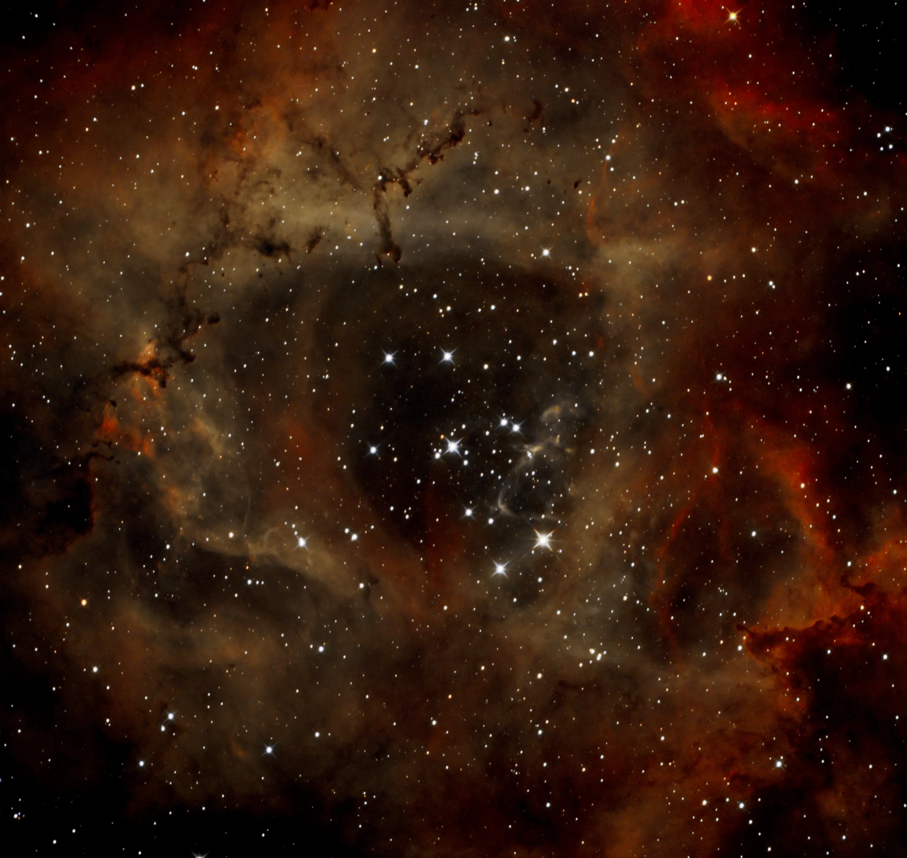
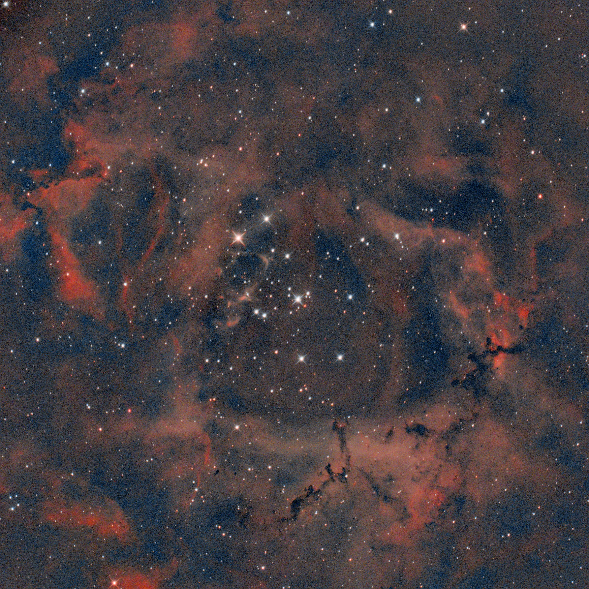

Some images sit forgotten on the hard drive for months — or longer. This is one of them.

NGC 2244 is the open cluster at the heart of the Rosette Nebula (NGC 2237), one of the most iconic star-forming regions in the northern celestial hemisphere. The young, massive stars of this cluster ionize the surrounding gas and carve the characteristic cavity that makes the Rosette so recognizable. A beautiful narrowband target — and one I had captured but never properly processed.

---

## A session with no documentation

When I opened these files, I realized I had recorded almost nothing about the session. Filter, date, telescope — all uncertain. A painful reminder of how important it is to document every observing night before putting the equipment away.

What I knew from memory: probably L-eXtreme, probably the Newtonian. To confirm, I checked the FITS header of the stack itself. The `FOCALLEN` field read **698mm** — the ASKAR FRA400 would sit around 400mm, so it could only be the Newtonian 150/750. Mystery solved.

The number of integrated frames was another thing I couldn't remember: **23 frames**. Few. Very few for narrowband, especially under Porto Alegre's urban skies.

---

## The challenge: few frames, a lot of noise

With only 23 frames, the stack's SNR (signal-to-noise ratio) is significantly lower than I'm used to. For comparison, the IC 2944 I processed recently had 72 frames, and NGC 5139 reached 147. Working with 23 means noise will appear in the diffuse nebulosity regions, and any aggressive stretch will leave a grainy background.

The strategy was to adapt the parameters to this scenario:

- **Higher denoising** — strength 0.78 in GraXpert, versus the 0.70 I usually use
- **Conservative stretch** — GHS with SP=0.22, D=3.8, b=5.0, HP=0.98
- **Not forcing the OIII** — with few frames, the OIII signal in the Rosette is weak. Pushing too hard would result in color artifacts

---

## The processing

The workflow followed the standard L-eXtreme protocol in Siril 1.4.0-beta2:

1. **Background extraction** with GraXpert 3.0.2 (Umbriel) — smoothing 0.5, GPU active
2. **PCC skipped** — photometric color calibration makes no sense in narrowband
3. **GHS stretch** — one pass with the parameters above
4. **GraXpert AI denoising** — strength 0.78, ~1min 54s with GPU
5. **Curves Transformation** — gentle S-curve to enhance contrast in the structures
6. **SCNR** — removal of residual green cast
7. **Color Saturation** — applied, but with minimal effect (expected from OSC with narrowband)
8. **16-bit TIFF export** to Affinity V2

In **Affinity V2**, the main work was channel editing:

- Master RGB curves for visual stretch and S-curve
- Blue channel lifted in midtones (X=0.5, Y=0.65) to pull the OIII
- Green channel lifted (X=0.5, Y=0.55) to create transition between H-alpha and OIII regions
- Levels with black at 1% to darken the background
- HSL with saturation +15%

One lesson learned worth recording: trying to aggressively anchor the green channel shadows to "clean" the background resulted in very strong red dominance, destroying the tonal separation we had built. With narrowband on an OSC camera, it's better to accept a slightly warm background than to force neutralization and lose the nebula's midtones along with it.

---

## The result

Despite the limitations, the final image surprised me. The central cavity ionized by NGC 2244 came out well-defined — that dark hole at the heart of the nebula, swept clean by the stellar winds of the OB stars in the cluster, is one of the most impressive structures in the deep sky. The filaments and gas pillars surrounding the cavity have good detail for the available integration.

The warm tonality — orange/rust predominating — is honest with the data. With 23 frames and H-alpha dominating over OIII, the classic red/blue bicolor of the Rosette did not emerge strongly. But the structure is there.

---

## What a new session could change

With 80–100 well-documented frames, the result would be considerably different:

- The OIII would appear with more strength, allowing more pronounced bicolor contrast
- The diffuse nebulosity regions at the edges would gain texture
- The background would be cleaner, allowing a more aggressive stretch without artifacts

The Rosette is a target I intend to return to — this time with complete notes from the start of the session.

---

## The first version — when I didn't understand what I was doing

Before arriving at the final image of this revisit, there is an older version — the first time I processed this data, right after capturing it. I keep it not out of vanity, but because it tells an important story.

Back then, I didn't understand the L-eXtreme filter's behavior well. I processed the data as if it were a standard broadband image — automatic stretch, intuitive color adjustments, without understanding what the filter was actually capturing. The result was an image with a dominant blue-gray background, H-alpha structures appearing as fragmented red at the edges with no coherence, and background noise being amplified and mistakenly interpreted as OIII signal.

The central cavity — the Rosette's most distinctive signature — barely shows. The NGC 2244 cluster is there, but without the contrast that separates it from the surrounding gas. The image has information, but the processing didn't know what to do with it.

What this first version shows, in practice, is what happens when you apply broadband logic to narrowband data: the background dominates, colors lose physical reference, and noise becomes a "feature." This isn't a capture error — the data was the same. It's a misinterpretation of what the filter delivers.

The comparison between the two versions is more educational than anything I could write about narrowband processing.

---

## Most important lesson from this session

Document everything. Date, telescope, filter, temperature, individual exposure time. The ASIAIR Plus records most of this automatically in the FITS header, but relying only on that and having no personal log is a risk. One line of text on your phone before putting the equipment away would have saved all the forensic investigation in this session.

Old data has value. This image sat forgotten for months and still had enough to tell a story. But it would have had far more value if I had known exactly how it was captured.

---

*Processed in Siril 1.4.0-beta2 + GraXpert 3.0.2 + Affinity V2 (Pixel Studio)*  
*Porto Alegre, RS — April 2026*
