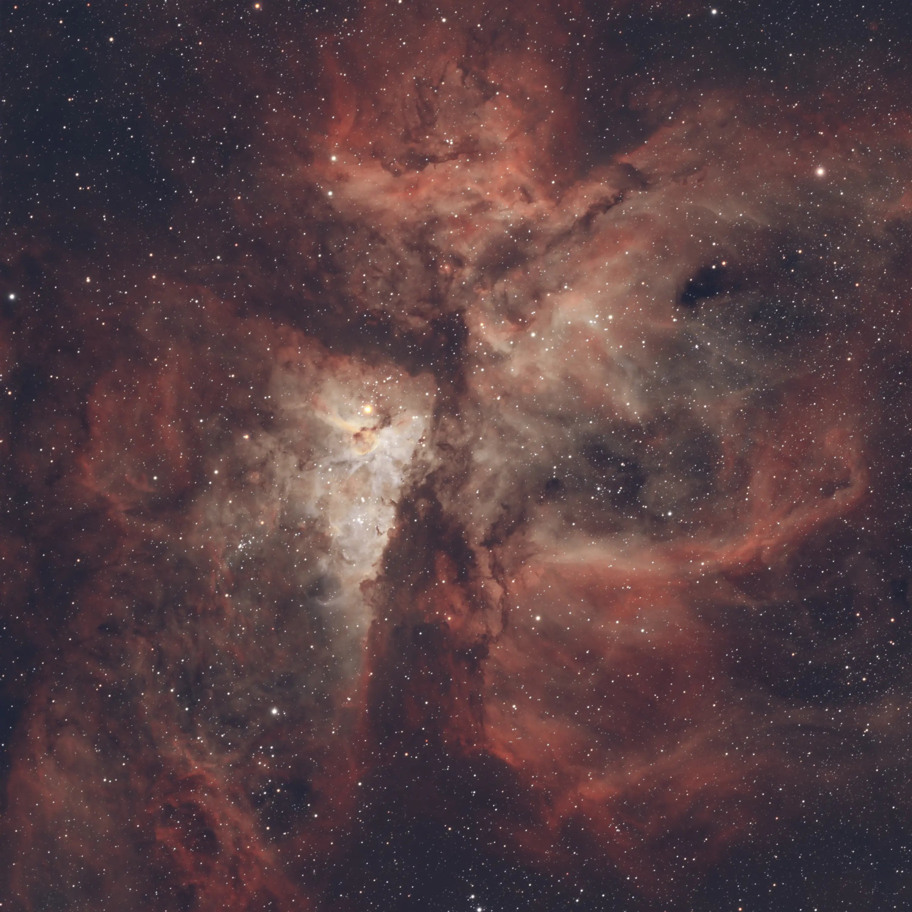

## The Object

The Carina Nebula (NGC 3372) is one of the largest and most luminous star-forming regions in the southern sky, located approximately 7,500 light-years away in the constellation Carina. Spanning around 300 light-years, it surpasses the famous Orion Nebula in apparent size, though its greater distance makes it less obvious to the naked eye.

At the heart of the nebula lies Eta Carinae, one of the most massive and unstable stars known — with an estimated mass between 100 and 150 solar masses. In the 19th century, Eta Carinae underwent a tremendous outburst known as the "Great Eruption" (1837–1858), briefly becoming the second-brightest star in the sky. It is now enshrouded in a compact bipolar nebula called the Homunculus, ejected during that eruption, and is considered a candidate for a future hypernova or supernova — on astronomical timescales.

The region around NGC 3372 also hosts Trumpler 14, one of the youngest and densest open clusters in the Galaxy, with stars just one to two million years old. The dark filaments visible in the image are pillars of dense gas and dust where new stellar systems are forming, sculpted by the intense stellar winds from the region's massive stars.

Located at roughly −60° declination, the Carina Nebula is a southern-hemisphere exclusive — invisible to the vast majority of northern observatories. For Brazilian observers, it transits at comfortable altitudes during the austral summer, offering a privileged view into one of the most dynamic regions of the Milky Way.

---

## The Capture

This image was captured from Porto Alegre, RS, under urban skies at Bortle 7, using the Optolong L-eXtreme filter in narrowband mode. The filter transmits only the H-alpha (656nm) and OIII (500nm) emission lines, effectively suppressing light pollution and allowing nebular structure to be captured even under compromised skies.

30 frames of 300 seconds each were integrated, totaling 150 minutes of exposure. The ZWO ASI533MC Pro ran cooled to minimize thermal noise, with guiding performed via the ASIAIR Plus using a ZWO ASI120 guide camera.

---

## The Processing

**Stacking — Siril 1.4.0-beta2**

The 30 frames were calibrated and integrated in Siril using Winsorized Sigma Clipping rejection (low=3.0, high=3.0), additive combination with scaling and normalization enabled. Per-channel rejection rates ranged from 0.3% to 0.7%, indicating a homogeneous frame set.

**Post-stacking — Siril**

Gradient extraction was performed with GraXpert 3.0.2 (Umbriel) via external interface, using the AI algorithm in subtraction mode with smoothing set to 0.5 — a conservative value to preserve Carina's extended nebulosità. Photometric Color Calibration (PCC) was intentionally skipped, as the L-eXtreme narrowband filter makes that step inappropriate.

Stretch was applied with Generalised Hyperbolic Stretch (GHS) using parameters SP=0.22, D=3.8, b=5.0 and HP=0.98 in a single pass, placing the inflection point in the mid-shadows — ideal for narrowband emission nebulae. GraXpert AI denoising was applied at strength 0.76 with GPU acceleration active. A 5-point curve transformation and SCNR green noise removal were applied last to eliminate residual green cast.

**Finishing — Affinity Photo V2**

In Affinity, color adjustment was kept deliberately minimal to respect the narrowband data. A single curve on the blue channel (X=0.5 → Y=0.58) was applied to introduce H-alpha/OIII contrast without distorting the palette — with the L-eXtreme, H-alpha already dominates the red channel so strongly that any more aggressive blue boost or green suppression results in magenta dominance. Final steps included a levels adjustment with black point at 1% and a +15% saturation boost via HSL.

---

## Result

Carina's characteristic "X" structure is well revealed, with four arms of nebulosity opening outward from Eta Carinae. The dark dust filaments — stellar nursery pillars — show good contrast against the surrounding H-alpha emission. A future session with 60 to 80 frames should reveal the outer extensions of the nebula and finer detail in the pillars further from the center.
