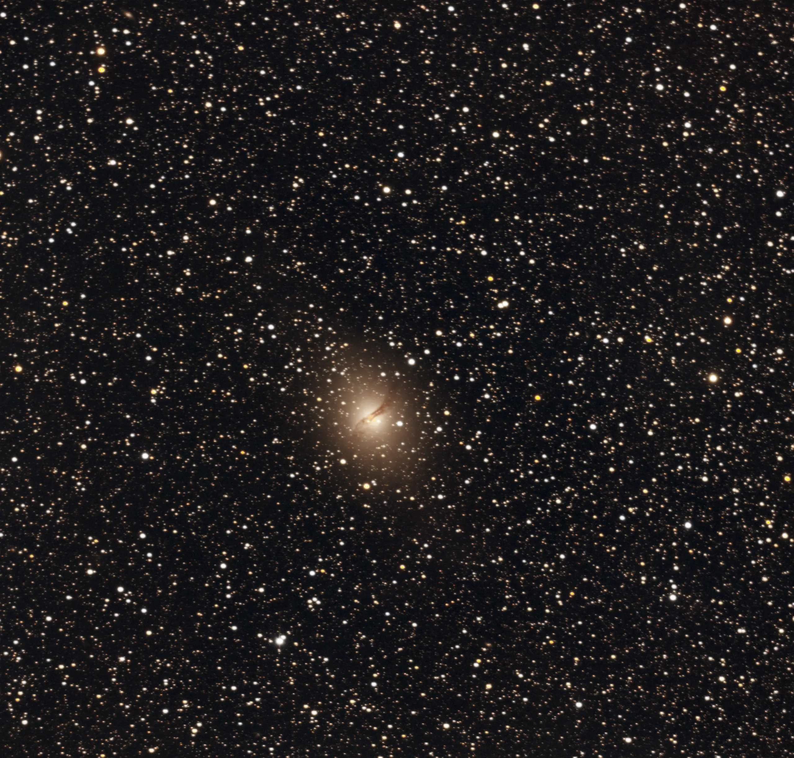

## NGC 5128 — Centaurus A

Centaurus A is, without a doubt, one of the most fascinating galaxies in the southern sky. Located roughly 13 million light-years away in the constellation Centaurus, it carries a distinctive feature that makes it instantly recognizable: a dark dust lane slicing across its elliptical core — the remnant of a galactic merger that occurred millions of years ago.

Beyond its striking visual structure, NGC 5128 hosts one of the closest active galactic nuclei (AGN) to Earth, with a supermassive black hole of tens of millions of solar masses accelerating jets of matter to relativistic speeds. A target that combines visual beauty and extreme physics in a single object.

---

## Capture conditions

This image was obtained from Porto Alegre's urban sky under Bortle 7 conditions, using an Optolong L-Pro filter to reduce light pollution. 59 frames were integrated in 32-bit with Winsorized Sigma Clipping, resulting in a rejection of only 0.2–0.6% per channel — a clean, balanced stack despite the modest frame count.

The cooled ZWO ASI533MC Pro ensured low thermal noise even without darks, and the EQ-5 mount with OnStep provided stable tracking throughout the session.

---

## Processing

The entire post-stacking workflow was done in **Siril 1.4.0-beta2**, followed by finishing in **Affinity V2**.

### In Siril

**Background Extraction** with GraXpert 3.0.2 (AI algorithm, smoothing 0.7) removed light pollution gradients before any color adjustment. Then, **Photometric Color Calibration** using the Gaia DR3 catalog calibrated colors based on 1,061 reference stars — the resulting factors (K0=1.000, K1=0.543, K2=0.472) revealed the red channel dominance characteristic of Porto Alegre's sky with the L-Pro filter.

The **stretch** was done with GHS (Generalised Hyperbolic Stretch) in a single pass: D=3.680, b=4.500, SP=0.18, and HP=0.97. For galaxies with a bright AGN nucleus, a slightly higher SP than what's used on globular clusters avoids saturating the center while still revealing the surrounding diffuse structure. **Denoising** with GraXpert AI (strength 0.77, GPU enabled) completed in just 1 minute and 24 seconds, cleaning the background without compromising field stars.

StarNet was run to generate a star mask, but the resulting starless image wasn't used as a base — Cen A's extremely bright AGN nucleus creates residual halos during star removal, making the starless file unsuitable for this target. Processing continued directly on the starred image.

### In Affinity V2

The finishing included a gentle S-curve on the master RGB channel for depth, a light blue channel adjustment (midtones +0.02) to neutralize the residual warm cast from the L-Pro, +15% saturation in HSL to reveal real star colors without overdoing it, and a 3% black input levels adjustment to darken the background.

---

## Result

Cen A's dust lane came out clearly defined crossing the elliptical nucleus. The galaxy's halo shows smooth gradation with the golden/yellowish tone characteristic of elliptical galaxies rich in old stars. The star field is extraordinarily rich — a result of Cen A's proximity to the galactic plane — with stars displaying natural colors ranging from orange giants to blue-white younger stars.

With only 59 frames from an urban sky, Cen A's faint outer halo is not yet fully revealed. It extends well beyond the visible limits in this image and requires more integration time — and ideally a darker sky — to appear in its full extent.

---

## Next steps

The goal for a next Centaurus A session is to reach 150+ frames, preferably from Cambará do Sul, where the dark sky will allow the diffuse halo extensions to be revealed. The L-Pro filter remains the right choice for this target — elliptical galaxies don't emit in H-alpha or OIII, so the L-eXtreme wouldn't bring any real gain here.

---

*Processed with Siril 1.4.0-beta2 + GraXpert 3.0.2 + Affinity V2*
