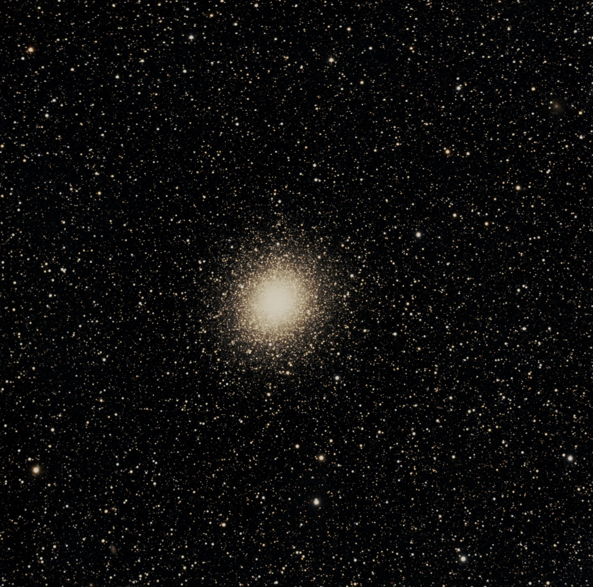

## The object

NGC 5139, known as Omega Centauri, is no ordinary globular cluster. It is the largest and most massive in the Milky Way — roughly 10 million stars compressed into a sphere about 150 light-years across, at a distance of around 17,000 light-years from Earth. Its scale is so extreme that astronomers suspect it is actually the remnant nucleus of a dwarf galaxy absorbed by the Milky Way billions of years ago.

For observers in the southern hemisphere, Omega Centauri is spectacular even with the naked eye — it appears as a "blurry star" of magnitude 3.9 in the constellation Centaurus. Through a telescope, it is simply unmatched.

## Capture

The session took place in the early hours of April 19, 2026, from a backyard in Porto Alegre — Bortle 7 sky, moderate urban light pollution, and the red channel heavily contaminated, as is typical for the city. The object was in an excellent position for the southern hemisphere, crossing the meridian around local midnight.

The setup used was the ASKAR FRA400 apochromatic refractor, a compact and portable lens that delivers good optical quality for deep sky work. The camera was the cooled ZWO ASI533MC Pro, with an Optolong L-Pro filter to partially mitigate light pollution without resorting to narrowband — which would make no sense for a globular cluster, as it produces no significant nebular emission.

The EQ-5 mount with OnStep handled tracking, and the ASIAIR Plus centralized camera control, plate solving, and guiding. **147 frames** were integrated in 32-bit with Winsorized Sigma Clipping (low=3.0, high=3.0), resulting in an extremely balanced per-channel rejection rate — between 0.3% and 0.6% — a sign of a clean session with no significant artifacts.

The cooled camera eliminated the need for darks, simplifying the calibration workflow.

## Processing

The entire post-processing workflow was done in **Siril 1.4.0-beta2**, with external tools integrated via its interface. The steps followed this order:

**Background Extraction (GraXpert 3.0.2)**
Before any stretch, the background gradient was removed with GraXpert in AI mode, smoothing 0.5, subtraction correction. Siril 1.4.x deprecated the internal C interface for GraXpert — the external executable must be installed and pointed to in File → Preferences → Miscellaneous.

**Photometric Color Calibration**
Using the Gaia DR3 catalog, PCC calibrated the white balance against 1,582 reference stars. The resulting factors were K0=1.000 (red), K1=0.552 (green), K2=0.477 (blue) — an expected deviation for Porto Alegre with the L-Pro filter, where the red channel dominates. The algorithm corrected automatically.

**Generalised Hyperbolic Stretch**
The stretch was the most critical step. NGC 5139 has an extremely bright nucleus and an outer halo with far dimmer stars — the challenge is balancing the two without blowing out the center or losing the halo.

The configuration that worked: D=4.153, b=3.640, SP=0.13365, HP=0.98000 — a single pass with logarithmic scale active. The key is the low SP (~0.13): it positions the curve's inflection point in the shadows, pulling out the halo without compressing the highlights. A high SP (>0.40), as initially tested, crushes the nucleus and wastes the halo.

**Denoising (GraXpert AI)**
With 147 frames integrated, noise was already low. Denoising at strength 0.62 was enough to clean the background without softening the outer halo stars. Running on CPU, it took about 15 minutes — with GPU the time drops to 1–2 minutes.

**Curves Transformation**
Seven points on a cubic spline, logarithmic scale, no clipping on any channel. Points were adjusted to darken the background while preserving texture, bring out midtone stars, and protect the nucleus.

**Color Saturation and SCNR**
Two light saturation passes (0.35 and 0.20, background factor 0.50) to reveal real star colors without overdoing it. SCNR then removed the residual green cast typical of Porto Alegre's light pollution.

**Finishing in Affinity V2**
The 16-bit TIFF was exported and finished in Affinity V2 (Pixel Studio) with per-channel curve adjustments for final color cast neutralization and a touch of contrast.

## Result

The ASKAR FRA400's field of view captures NGC 5139 in full with generous space around it. Stellar resolution in the outer halo is well preserved, with individual stars separated all the way to the cluster's edges. The nucleus came out bright and clean without visible saturation. The background field is extraordinarily rich — the proximity to Centaurus's galactic plane fills the frame with stars of varied colors, and at least two background galaxies are visible in the corners of the image.

For a session under a Bortle 7 sky, the result exceeded expectations. With more integration — 200+ frames — and ideally a night at Cambará do Sul, the cluster's more diffuse outer halo could be revealed with even greater depth.

---

*Processed with Siril 1.4.0-beta2, GraXpert 3.0.2 (Umbriel), and Affinity V2.*
