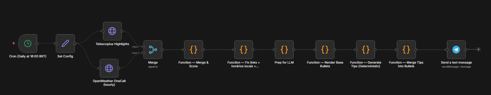
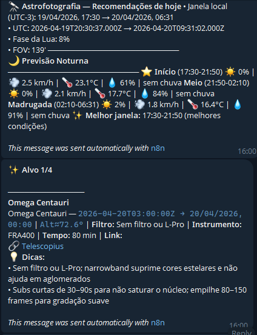

Anyone who shoots deep sky knows that most of the work happens **before** the telescope is even on. Deciding what to photograph means weighing moon phase, weather forecast, object altitude, equipment constraints, and how much night you actually have. I used to do all of this manually — separate apps, notes on paper. I decided to automate it.

The result is an **n8n** workflow that runs every day at 4 PM and sends me a complete report on **Telegram** with the best targets for that night — suggested filters, recommended time per target, and weather forecast broken down by time window.

---

## The core idea

The goal wasn't just to list visible objects. Any astronomy app does that. The idea was a ranking that answered a more specific question: **given my equipment, my sky, and tonight's conditions, what is actually worth imaging?**

To do that, the workflow combines three data sources and applies a custom scoring model.

---

## Data sources

### Telescopius API

[Telescopius](https://telescopius.com) is an astrophotography platform that, among other things, exposes a REST API for patrons. It returns a list of "highlights" — recommended deep sky objects for a given location, with metadata like magnitude, angular size, type, and RA/Dec coordinates.

The main endpoint used is the highlights feed, which already applies basic filters for minimum altitude and moon distance. The returned data is enough to compute hourly sky position throughout the night.

### OpenWeather OneCall API

The hourly forecast from [OpenWeather](https://openweathermap.org/api/one-call-3) provides cloud cover, humidity, wind, precipitation probability, and visibility for each hour of the night. This feeds both the per-period condition breakdown (early night, mid-night, dawn) and the per-object score.

### Local astronomical calculations

To determine each object's altitude at each hour of the night, the workflow computes it directly in JavaScript — no external API needed. The implementation covers:

- **GMST** (Greenwich Mean Sidereal Time) from a Unix timestamp
- **LST** (Local Sidereal Time) adjusted for local longitude
- **Altitude** via spherical astronomy formulas using the object's RA/Dec and the observer's latitude

This allows computing, for each hour between sunset and sunrise, the altitude of any object — and cross-referencing it with weather conditions at that exact hour.

---

## The scoring model

This is the heart of the system. Each object receives a composite score built from four factors:

### 1. Conditions × altitude score

For each hour of the night window where the object is above the configured minimum altitude (35°):

```
hour_score = scoreCond(clouds, humidity, wind) × (altitude - alt_min) / (90 - alt_min)
```

The final conditions score is the average across all valid hours. This favors objects that are high up **during the best hours of the night**, not just at some point.

### 2. FOV compatibility

The camera sensor (square, 9×9mm) has a field of view that varies depending on the instrument and whether a reducer is in use. The workflow computes the FOV in arcminutes and scores each object by the ratio of its angular size to the available FOV:

| Object/FOV ratio | Score |
|---|---|
| < 5% | 0.20 — too small, no useful detail |
| 15–60% | 1.00 — ideal fit |
| > 100% | 0.20 — requires mosaic |

A 15′ globular cluster shot with the refractor in standard mode occupies about 11% of the FOV — a reasonable score. The same object with the longer focal-length Newtonian fills more frame and moves up in the ranking.

### 3. Moon penalty by object type

The moon affects different targets very differently. An emission nebula shot with an L-eXtreme filter (which isolates Hα and OIII) is barely impacted even with a bright moon. A low-surface-brightness galaxy under 80% illumination in an urban sky is practically unworkable.

```
moon_penalty(emission + L-eXtreme, 70% moon) = 5%
moon_penalty(LSB galaxy, 70% moon)            = 65%
```

### 4. Surface brightness penalty

For galaxies and diffuse objects, the estimated surface brightness (mag/arcsec²) is cross-referenced against the practical limit of the urban sky. Overly diffuse targets are penalized or filtered out.

---

## Suggested filter and instrument

Based on object type and moon phase, the system automatically suggests:

- **Filter**: from the actual available inventory — L-eXtreme, L-Pro, UHC, CLS
- **Instrument**: refractor or Newtonian, based on the object's angular size

For example: small planetary nebulae (<5′) automatically go to the Newtonian, which delivers higher plate scale. Large emission nebulae (>60′) go to the refractor with a 0.7× reducer.

---

## Time allocation

The available session time (configurable, default 240 minutes) is distributed proportionally to each object's score, respecting a per-target minimum. The result shows up in the report as a table with suggested minutes per object.

---

## Workflow architecture

The n8n flow runs in this sequence:

```
Cron (4 PM) → Set Config
            → [OpenWeather + Telescopius] in parallel
            → Merge
            → Merge & Score        ← main calculation
            → Fix links + local times
            → Prep Context
            → Render Base Bullets  ← formats each target
            → Generate Tips        ← deterministic tips by type
            → Merge Tips + Bullets ← builds HTML for Telegram
            → Send Telegram        ← sends separate messages per target
```



One notable design decision: the per-object tips are generated deterministically in JavaScript, not by an LLM. An earlier version used a local model via Ollama, but the deterministic approach is faster, more predictable, and eliminates an extra failure point.

---

## The Telegram report

The report arrives as separate messages to stay within Telegram's size limit:

1. **Header**: night window, moon phase, active FOV
2. **Night forecast**: conditions by period (early, mid-night, dawn)
3. **One message per target**: ideal time window (UTC and local), altitude, filter, instrument, suggested time, and Telescopius link
4. **Checklist + time table**: operational items and session minute breakdown



---

## Per-session configuration

All customization lives in a single config node. Switching the instrument from `FRA400` to `NEWTONIAN` changes the computed FOV, scores, filter suggestions, and tips — without touching any other node.

Main parameters:
- Location (lat/lon)
- Active instrument and reducer usage
- Minimum altitude and minimum object size
- Moon threshold for prioritizing narrowband
- Total session time and per-target minimum

---

## Next steps

A few ideas still in the backlog:

- **Portable session support**: change location to Cambará do Sul with a single parameter and recompute everything for dark skies
- **Session history**: log what was imaged to penalize already well-integrated targets
- **Seeing alert**: pull data from [Astrospheric](https://www.astrospheric.com) or similar to estimate predicted seeing, not just transparency and wind
- **Window notification**: beyond the 4 PM report, an alert when the best window of the night is about to start

---

## References and resources

- [Telescopius](https://telescopius.com) — astrophotography planning platform
- [Telescopius API](https://api.telescopius.com) — REST documentation (patron access)
- [OpenWeather One Call API 3.0](https://openweathermap.org/api/one-call-3)
- [n8n](https://n8n.io) — self-hosted automation platform
- [Siril](https://siril.org) — astronomical image processing
- [GraXpert](https://www.graxpert.com) — gradient extraction and AI denoising
